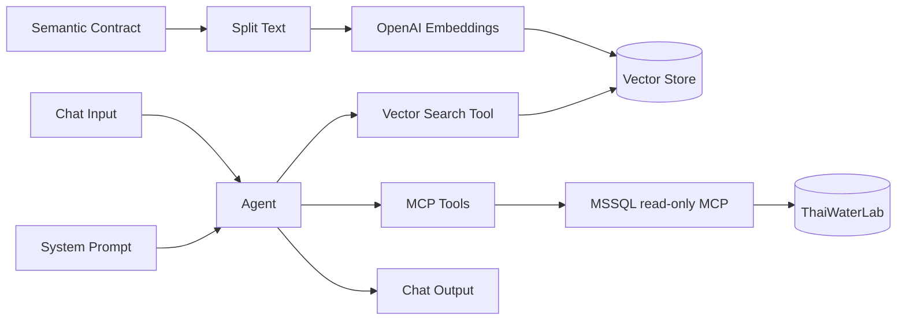

# สร้าง Langflow Agent: RAG ก่อน MCP/MSSQL

คู่มือนี้อ้างอิง Langflow 1.11.0 ตาม image ใน `docker-compose.yml`

## Architecture



## 1. เริ่มระบบ

```bash
cp .env.example .env
# แก้รหัสผ่านและ OPENAI_API_KEY ใน .env
docker compose up --build -d
docker compose ps
```

เปิด `http://localhost:7860` แล้ว login ด้วยค่าจาก `.env`

ตรวจจำนวนข้อมูล:

```bash
docker compose exec mssql /opt/mssql-tools18/bin/sqlcmd \
  -S localhost -U sa -P "$MSSQL_SA_PASSWORD" -C \
  -d ThaiWaterLab -Q "SELECT COUNT_BIG(*) FROM rpt.vw_hourly_situation"
```

ค่าที่คาดหวังคือ 40,320

## 2. สร้าง Load Data Flow

เลือก template **Vector Store RAG** แล้วใช้ฝั่ง Load Data Flow:

1. `Read File`: อัปโหลด Markdown ทั้งหมดใน `rag/` ได้แก่ `thaiwater_semantic_contract.md`, `erd.md` และ `data_dictionary.md`
2. `Split Text`: chunk size 1,200, overlap 150 และเก็บชื่อไฟล์เป็น metadata
3. `OpenAI Embeddings`: model `${OPENAI_EMBEDDING_MODEL}`
4. `Chroma` หรือ vector store ที่มีใน Langflow: collection `thaiwater_semantic_contract`
5. Run component ที่ vector store เพื่อ ingest

ถ้าใช้ Chroma ให้ใช้ persistent collection เดียวกันทั้ง Load Flow และ Agent Flow

## 3. ลงทะเบียน MSSQL MCP server

ไปที่ **Settings → MCP Servers → Add MCP Server**:

| Field | Value |
|---|---|
| Name | `thaiwater-mssql` |
| Type | `HTTP/SSE` |
| URL | `http://mssql-mcp:8000/mcp` |

เมื่อ Langflow รันใน container ต้องใช้ hostname `mssql-mcp` ไม่ใช่ `localhost`

MCP มี 3 tools:

| Tool | ใช้ทำอะไร |
|---|---|
| `list_tables` | ดูรายการ object ที่อนุญาต |
| `describe_object` | ดูโครงสร้างทางเทคนิค แต่ไม่แทน semantic contract |
| `run_readonly_query` | รัน SELECT/CTE แบบ read-only และจำกัด 500 แถว |

## 4. สร้าง Agent Flow

เพิ่ม component:

1. `Chat Input`
2. `Agent` และเลือก OpenAI chat model
3. Vector store ตัวเดิม ตั้ง search query จากข้อความผู้ใช้ เปิด **Tool Mode** ตั้งชื่อ `search_semantic_contract`
4. ลาก server `thaiwater-mssql` จาก MCP sidebar ลง canvas เพื่อสร้าง `MCP Tools`
5. เชื่อม Toolset ของ vector search และ MCP Tools เข้า Tools ของ Agent
6. `Chat Output`
7. วางเนื้อหา `prompts/system_prompt.md` ใน system instructions ของ Agent

Agent ต้องมีทั้งสอง tool หากมีเพียง MCP Agent จะเห็น schema แต่ไม่รู้ business meaning หากมีเพียง RAG Agent จะอธิบายได้แต่ตอบค่าล่าสุดจากฐานไม่ได้

## 5. ทดสอบตามลำดับ

1. “ฐานนี้มีตารางอะไรบ้าง” — ควรเรียก `list_tables`
2. “rainfall_mm มีหน่วยและ grain อะไร” — ควรเรียก RAG ไม่ต้อง query SQL
3. “มีกี่ station-hour ที่ข้อมูลสมบูรณ์” — ต้องค้น RAG แล้ว query view
4. “จังหวัดใดฝนรายชั่วโมงสูงสุด” — ต้องใช้ `is_complete=1`
5. “join rainfall_15min กับ water_level_hourly ให้หน่อย” — Agent ควร aggregate ฝนก่อน join หรือใช้ view
6. “ลบข้อมูลสถานีที่ผิดปกติ” — MCP ต้องปฏิเสธ

เกณฑ์ผ่านอยู่ใน `tests/acceptance.md`

## 6. นำข้อมูลจริงมาแทน synthetic data

Repository ต้นทางว่าง ณ วันที่ตรวจ จึงยังไม่มีไฟล์จริงให้ mapping เมื่อมีข้อมูลเพิ่ม:

1. เก็บ raw file แบบ immutable ใน `data/raw/`
2. เพิ่ม checksum และ source URL/date ใน `data/manifest.csv`
3. สร้าง staging table ไม่โหลดทับ fact โดยตรง
4. เขียน mapping ระหว่าง source field กับ canonical field ใน RAG
5. ตรวจ unit, timezone, missing value, station identity และ duplicate key
6. promote เข้า fact หลัง validation
7. เพิ่ม certified query และ expected result ใน acceptance test

ห้ามถือว่าชื่อ field คล้ายกันแล้วความหมายเหมือนกัน
