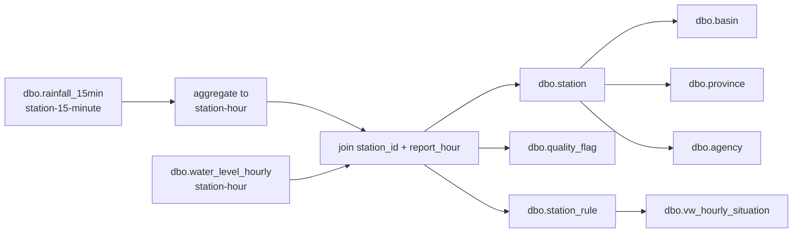

# Physical ERD — `thaiwater`

เอกสารนี้ตรงกับฐาน `thaiwater` ที่สร้างจาก `mssql/thaiwater_literal_10080.sql` ทุก object อยู่ใน schema `dbo` และข้อมูลทั้งหมดเป็นข้อมูลสังเคราะห์

## Full ERD

```mermaid
erDiagram
    AGENCY ||--o{ STATION : agency_code
    BASIN ||--o{ STATION : basin_code
    PROVINCE ||--o{ STATION : province_code
    STATION ||--o{ STATION_RULE : station_id
    STATION ||--o{ RAINFALL_15MIN : station_id
    STATION ||--o{ WATER_LEVEL_HOURLY : station_id
    QUALITY_FLAG ||--o{ RAINFALL_15MIN : quality_code
    QUALITY_FLAG ||--o{ WATER_LEVEL_HOURLY : quality_code

    AGENCY { varchar_10 agency_code PK
             nvarchar_200 agency_name_th }
    BASIN { char_2 basin_code PK
            nvarchar_100 basin_name_th }
    PROVINCE { char_2 province_code PK
               nvarchar_100 province_name_th }
    QUALITY_FLAG { char_1 quality_code PK
                   nvarchar_100 quality_name_th
                   bit usable_for_report }
    STATION { int station_id PK
              varchar_20 station_code UK
              nvarchar_200 station_name_th
              char_2 basin_code FK
              char_2 province_code FK
              varchar_10 agency_code FK
              decimal_9_6 latitude
              decimal_9_6 longitude
              varchar_20 vertical_datum }
    STATION_RULE { int station_id PK_FK
                   datetime2 effective_from PK
                   datetime2 effective_to
                   decimal_7_3 riverbed_level_m_msl
                   decimal_7_3 bank_level_m_msl
                   varchar_40 rule_version }
    RAINFALL_15MIN { bigint rainfall_id PK
                     int station_id FK
                     datetime2 observed_at UK
                     decimal_8_2 rainfall_mm
                     char_1 quality_code FK
                     datetime2 received_at }
    WATER_LEVEL_HOURLY { bigint water_level_id PK
                         int station_id FK
                         datetime2 observed_at UK
                         decimal_7_3 water_level_m_msl
                         decimal_10_2 discharge_cms
                         varchar_20 vertical_datum
                         char_1 quality_code FK
                         datetime2 received_at }
```

`UK` ของ observation คือ composite unique key `(station_id, observed_at)`

## Cardinality และ grain

| Object | Grain | Key | Rows |
|---|---|---|---:|
| `dbo.agency` | หนึ่งแถวต่อหน่วยงาน | `agency_code` | 4 |
| `dbo.basin` | หนึ่งแถวต่อลุ่มน้ำ | `basin_code` | 6 |
| `dbo.province` | หนึ่งแถวต่อจังหวัด | `province_code` | 12 |
| `dbo.quality_flag` | หนึ่งแถวต่อ quality code | `quality_code` | 4 |
| `dbo.station` | หนึ่งแถวต่อสถานี | `station_id`; UK `station_code` | 120 |
| `dbo.station_rule` | หนึ่งแถวต่อสถานีต่อกฎ | `(station_id,effective_from)` | 120 |
| `dbo.rainfall_15min` | หนึ่งแถวต่อสถานีต่อ 15 นาที | `rainfall_id`; UK `(station_id,observed_at)` | 40,320 |
| `dbo.water_level_hourly` | หนึ่งแถวต่อสถานีต่อชั่วโมง | `water_level_id`; UK `(station_id,observed_at)` | 10,080 |
| `dbo.vw_hourly_situation` | หนึ่งแถวต่อสถานีต่อชั่วโมง | logical key `(station_code,report_hour)` | 10,080 |

## Certified join path



ห้าม join ข้อมูลฝนกับระดับน้ำด้วย `station_id` อย่างเดียว ต้องรวมฝนเป็นรายชั่วโมงก่อน แล้ว join ด้วย `station_id + report_hour`

ข้อมูลชุดนี้มี rule เดียวต่อสถานี เริ่มมีผล `2026-07-21` และ `effective_to` เป็น `NULL` ทุกแถว ตัว view จึงตรวจเฉพาะ `observed_at >= effective_from`
