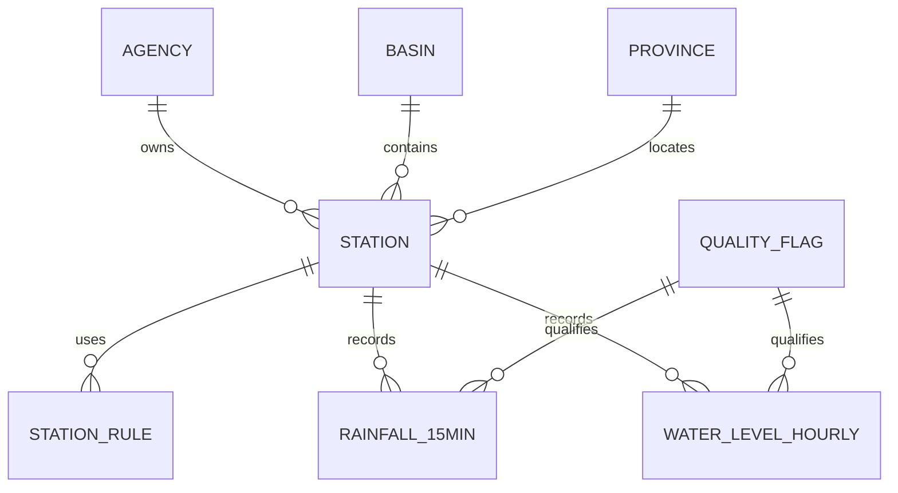

# ThaiWater Lab Semantic Contract

เอกสารนี้เป็น semantic contract สำหรับนำเข้า RAG ไม่ใช่ schema จริงของ ThaiWater, สสน. หรือ สทนช. เกณฑ์สาธารณะปรับจากเว็บไซต์มาตรฐานข้อมูลน้ำ ส่วน schema และข้อมูลเป็นข้อมูลสังเคราะห์ของ lab

## Dataset scope

ThaiWater เผยแพร่ observation 6 กลุ่ม: น้ำฝน น้ำท่า แหล่งน้ำขนาดใหญ่ แหล่งน้ำขนาดกลาง แหล่งน้ำขนาดเล็ก และคุณภาพน้ำ Lab นี้ใช้เฉพาะน้ำฝน น้ำท่า และสารสนเทศสถานีเพื่อให้มีเส้นทาง join ที่ชัดเจน

## Certified report

- Object: `rpt.vw_hourly_situation`
- Grain: หนึ่งแถวต่อหนึ่งสถานีต่อหนึ่งชั่วโมง
- Expected rows: 40,320
- Period: 2026-07-21 00:00 ถึงก่อน 2026-08-04 00:00 เวลาไทย
- Purpose: วิเคราะห์ฝน ระดับน้ำ อัตราการไหล และสถานการณ์น้ำใน lab
- Limitation: ทุกชื่อสถานี จังหวัด ลุ่มน้ำ และค่าตรวจวัดเป็นข้อมูลสังเคราะห์

## ERD and join path



เส้นทาง join ที่รับรอง:

1. `fact.rainfall_15min.station_id -> dim.station.station_id`
2. `fact.water_level_hourly.station_id -> dim.station.station_id`
3. `dim.station` เชื่อม `dim.basin`, `dim.province`, `dim.agency` ด้วยรหัส FK
4. `dim.station_rule` ต้อง join ด้วย station และ effective date แบบ `[effective_from,effective_to)`
5. การ join ฝนกับระดับน้ำต้อง aggregate ฝนราย 15 นาทีเป็นรายชั่วโมงก่อน แล้วเชื่อมด้วย `station_id + report_hour`

## Data dictionary

| Object.column | ความหมาย | Unit/grain | Rule |
|---|---|---|---|
| `fact.rainfall_15min.observed_at` | เวลาสิ้นสุดช่วงตรวจวัด | เวลาไทย, 15 นาที | ใช้จัด time bucket |
| `fact.rainfall_15min.received_at` | เวลาที่ระบบได้รับข้อมูล | เวลาไทย | ห้ามใช้แทน observation time |
| `fact.rainfall_15min.rainfall_mm` | ฝนในช่วง 15 นาที | mm | `NULL` คือไม่มีข้อมูล |
| `fact.water_level_hourly.water_level_m_msl` | ระดับผิวน้ำ | m MSL | เทียบ rule ได้เมื่อ datum ตรง |
| `fact.water_level_hourly.discharge_cms` | อัตราการไหล | m3/s หรือ cms | ไม่ใช่ปริมาตรน้ำ |
| `fact.water_level_hourly.vertical_datum` | datum ของ observation | code | ต้องตรง `dim.station.vertical_datum` |
| `dim.station_rule.riverbed_level_m_msl` | ระดับท้องน้ำ | m MSL | ฐาน 0% ของลำน้ำใน lab |
| `dim.station_rule.bank_level_m_msl` | ระดับตลิ่ง | m MSL | ฐาน 100% ของลำน้ำใน lab |
| `rpt.vw_hourly_situation.rainfall_1h_mm` | ผลรวมฝนที่ policy อนุญาต | mm/hour | ไม่จำเป็นต้อง complete |
| `rpt.vw_hourly_situation.channel_capacity_percent` | สัดส่วนระดับน้ำจากท้องน้ำถึงตลิ่ง | percent | `(level-riverbed)/(bank-riverbed)*100` |
| `rpt.vw_hourly_situation.is_complete` | row พร้อมใช้รายงาน | boolean | ฝนครบ 4 ค่า ระดับน้ำใช้ได้ และ datum ตรง |

## Quality codes

| Code | ความหมาย | usable_for_report |
|---|---|---:|
| `V` | ผ่านการตรวจสอบ | 1 |
| `P` | ข้อมูลเบื้องต้น | 1 |
| `S` | น่าสงสัย | 0 |
| `M` | ไม่มีข้อมูล | 0 |

การอนุญาต `P` เป็น policy ของ lab ไม่ใช่ความหมายที่ควรอนุมานจากตัวอักษร

## Business rules

| Rule | Definition |
|---|---|
| `BR-01` | Grain ของ certified report คือ station-hour |
| `BR-02` | Aggregate ฝนก่อน join เพื่อป้องกันระดับน้ำถูกทำซ้ำ 4 เท่า |
| `BR-03` | `NULL rainfall_mm` คือ missing ไม่ใช่ zero |
| `BR-04` | ฝนรายชั่วโมง complete เมื่อมี usable non-null ครบ 4 ค่า |
| `BR-05` | observation ที่ quality ใช้ไม่ได้ไม่ร่วม metric ทางการ |
| `BR-06` | rule ต้องเป็นรุ่นที่มีผล ณ observed_at |
| `BR-07` | datum ไม่ตรงให้สถานะ `DATUM_MISMATCH` ห้ามเทียบระดับ |
| `BR-08` | ความจุลำน้ำ `<=10%` = CRITICAL_LOW, `>10–30%` = LOW, `>30–70%` = NORMAL, `>70–100%` = HIGH, `>100%` = OVER_BANK |
| `BR-09` | รายงานทางการใช้เฉพาะ `is_complete=1`; รายงาน data quality ต้องรวม incomplete |
| `BR-10` | ทุกคำตอบต้องบอกว่าเป็นข้อมูลสังเคราะห์และระบุช่วงเวลา |

## Certified SQL examples

จำนวนสถานี-ชั่วโมงตามสถานการณ์สำหรับ row ที่สมบูรณ์:

```sql
SELECT water_situation, COUNT_BIG(*) AS station_hours
FROM rpt.vw_hourly_situation
WHERE is_complete = 1
GROUP BY water_situation
ORDER BY station_hours DESC
```

จังหวัดที่มีฝนรายชั่วโมงสูงสุด:

```sql
SELECT TOP (10) province_name_th, MAX(rainfall_1h_mm) AS max_rainfall_1h_mm
FROM rpt.vw_hourly_situation
WHERE is_complete = 1
GROUP BY province_name_th
ORDER BY max_rainfall_1h_mm DESC
```

ตรวจ data completeness:

```sql
SELECT is_complete, COUNT_BIG(*) AS station_hours
FROM rpt.vw_hourly_situation
GROUP BY is_complete
```

## Public references

- ThaiWater: https://www.thaiwater.net/
- ThaiWater Mobile data scope: https://www.thaiwater.net/mobile
- Water data standards: https://standard.thaiwater.net/docs/
